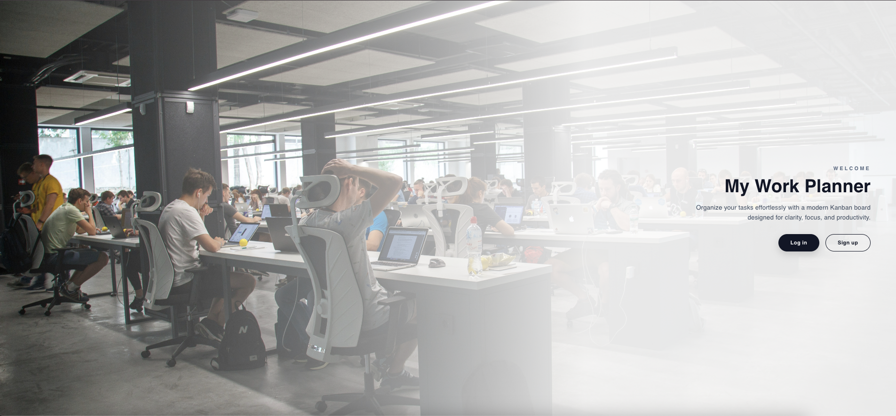
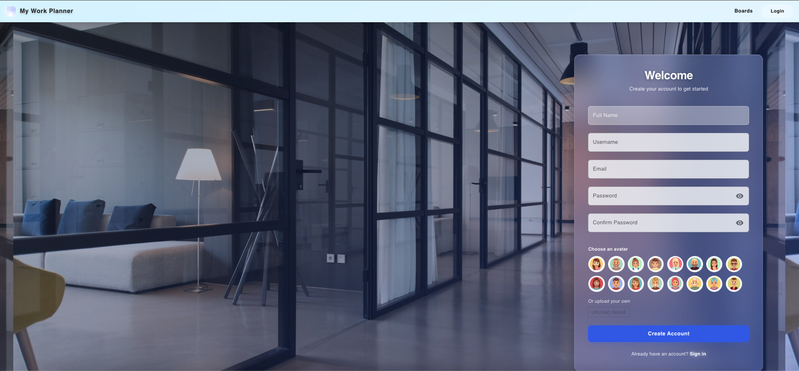
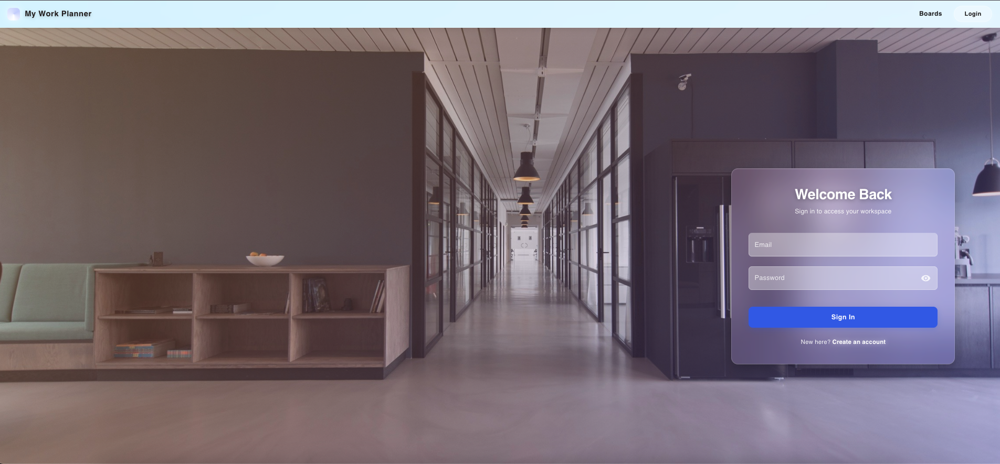
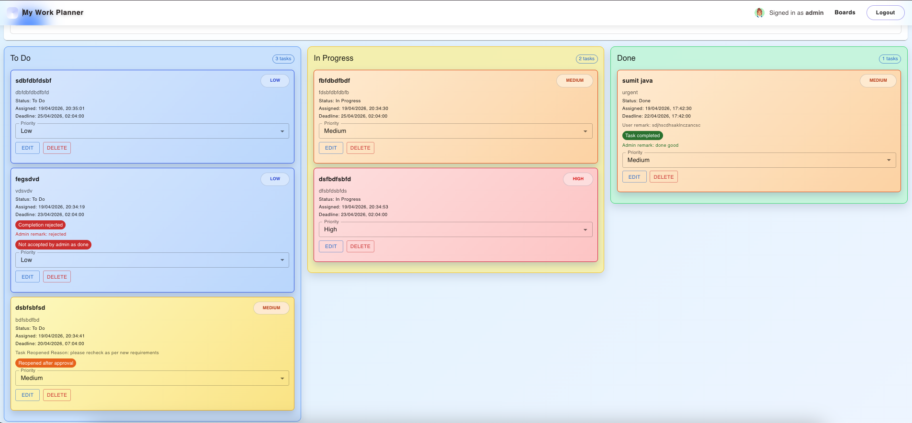
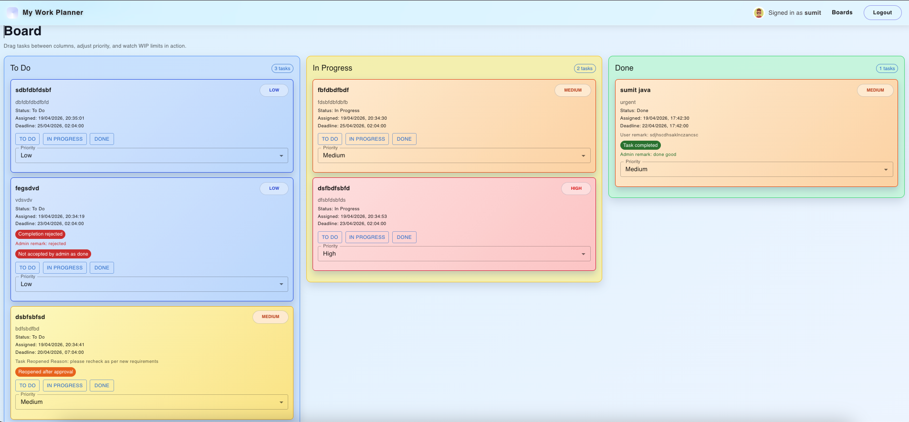
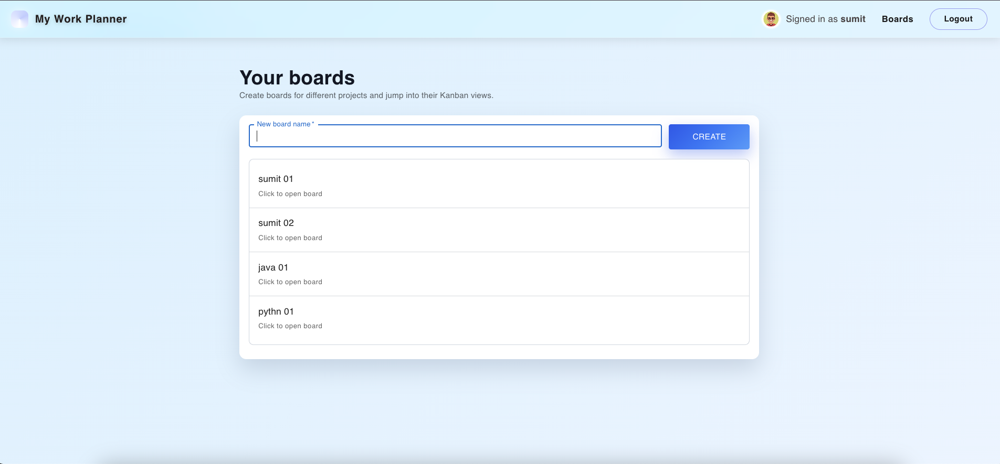
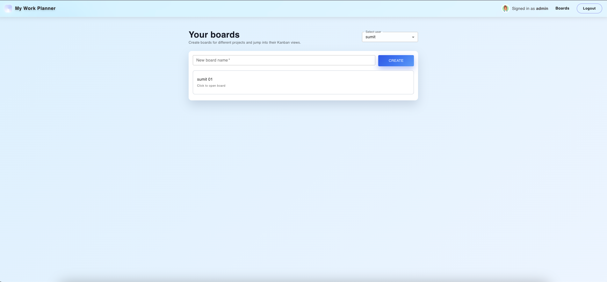

# 🗂️ My Work Planner — Full Stack Kanban Board

A production-level task management application built with **React.js**, **Spring Boot**, and **MongoDB**. Designed with real-world workflows in mind — featuring role-based access, admin approval systems, WIP limits, drag-and-drop task management, and a **fully responsive UI** that works seamlessly on desktop, tablet, and mobile.

🔗 **Live Demo:** [kanban-board-sooty-omega.vercel.app](https://kanban-board-sooty-omega.vercel.app)

---
### Important
```bash
For admin login use: admin@gmail.com
Password: @Sumit3o5
```


## 📸 Screenshots

### Landing Page


### Register & Login



### View[Admin & User]



### Kanban Board


### User Login Landing

 
---

## ✨ Features

### 🔐 Authentication & Roles
- User registration with **Full Name, Username, Email, Password**
- Choose from **16 unique avatars** or upload your own
- **JWT-based authentication** with role-based authorization
- First registered user is automatically assigned the **Admin** role
- All subsequent users are assigned the **User** role

### 📋 Boards
- Admin and users can **create their own boards**
- Admin can **view and manage all users' boards** via a dropdown selector
- Each board contains **3 columns**: To Do → In Progress → Done

### ✅ Task Management
- Tasks can only be **assigned by the Admin**
- Each task includes:
  - Title & Description
  - Assigned Date & Deadline
  - Priority: **Low / Medium / High** (color-coded cards)
- Both Admin and Users can **change task priority** via dropdown
- Tasks can be moved between columns via **drag & drop** or dropdown

### ⚡ WIP Limit
- **In Progress column is limited to 3 tasks** — enforcing real-world Kanban best practices

### 🔄 Admin Approval Workflow
- When a user marks a task as **Done**, they must provide a **completion remark**
- The task shows **"Waiting admin approval"** until reviewed
- **Admin can APPROVE** → task is locked in Done with a "Task completed" badge
- **Admin can REJECT** → task is returned to To Do with:
  - **"Completion rejected"** badge
  - **"Not accepted by admin as done"** label
  - Admin's rejection remark visible to the user

### 🔁 Task Reopening (Admin Only)
- Admin can **reopen a completed task** by providing a reason
- The task is moved back to **To Do** with:
  - **"Reopened after approval"** badge
  - Reopen reason visible to the assigned user
  - Different color to distinguish reopened tasks

### 📱 Responsive Design
- Fully responsive UI built with **Material UI (MUI)**
- Works seamlessly on **desktop, tablet, and mobile** devices
- Adaptive layouts for all screen sizes

---

## 🛠️ Tech Stack

| Layer | Technology |
|-------|-----------|
| Frontend | React.js, Material UI (MUI) |
| Backend | Java, Spring Boot, REST API |
| Database | MongoDB (Atlas) |
| Auth | JWT Authentication |
| Deployment | Vercel (Frontend), Render (Backend), MongoDB Atlas (DB) |

---

## 🚀 Getting Started Locally

### Prerequisites
- Java 17+
- Node.js 16+
- MongoDB (local or Atlas)

### Backend Setup
```bash
cd backend
./mvnw spring-boot:run
```

Make sure to set the following in `src/main/resources/application.properties`:
```properties
spring.data.mongodb.uri=your_mongodb_uri
jwt.secret=your_jwt_secret
jwt.expiration=86400000
server.port=8080
```

### Frontend Setup
```bash
cd frontend
npm install
npm start
```

The app will run at `http://localhost:3000`

---

## 📁 Project Structure

```
KanbanBoard/
├── backend/                  # Spring Boot REST API
│   └── src/
│       └── main/
│           ├── java/         # Controllers, Services, Models
│           └── resources/    # application.properties
├── frontend/                 # React.js Application
│   └── src/
│       ├── components/       # Reusable UI components
│       ├── pages/            # Page-level components
│       └── api.js            # Axios API configuration
└── README.md
```

---

## 🌐 Deployment

| Service | Platform | URL |
|---------|----------|-----|
| Frontend | Vercel | [kanban-board-sooty-omega.vercel.app](https://kanban-board-sooty-omega.vercel.app) |
| Backend | Render | [kanban-board-qctg.onrender.com](https://kanban-board-qctg.onrender.com) |
| Database | MongoDB Atlas | Cloud hosted |

> ⚠️ **Note:** The backend is hosted on Render's free tier and may take **30-50 seconds** to wake up on the first request after inactivity.

---

## 👨‍💻 Author

**Sumit Kumar**
- 📧 [develop.sumitkumar@gmail.com](mailto:develop.sumitkumar@gmail.com)
- 🌐 [Portfolio](https://developsumitkumar.github.io)
- 💻 [GitHub](https://github.com/developsumitkumar)

---

## 📄 License


